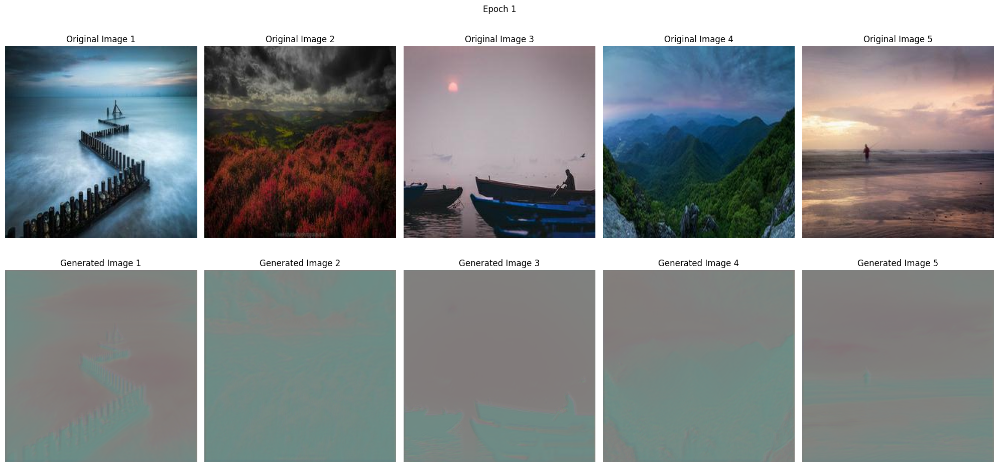
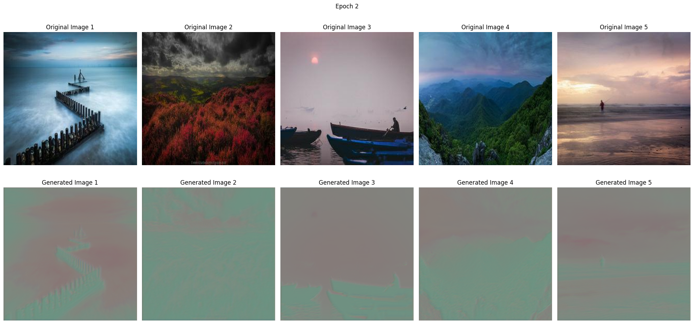
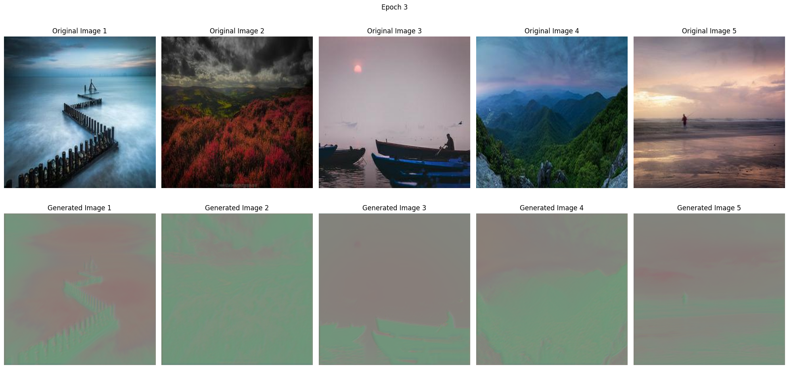
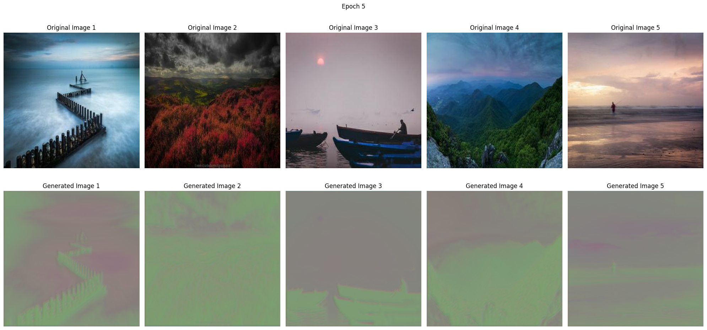
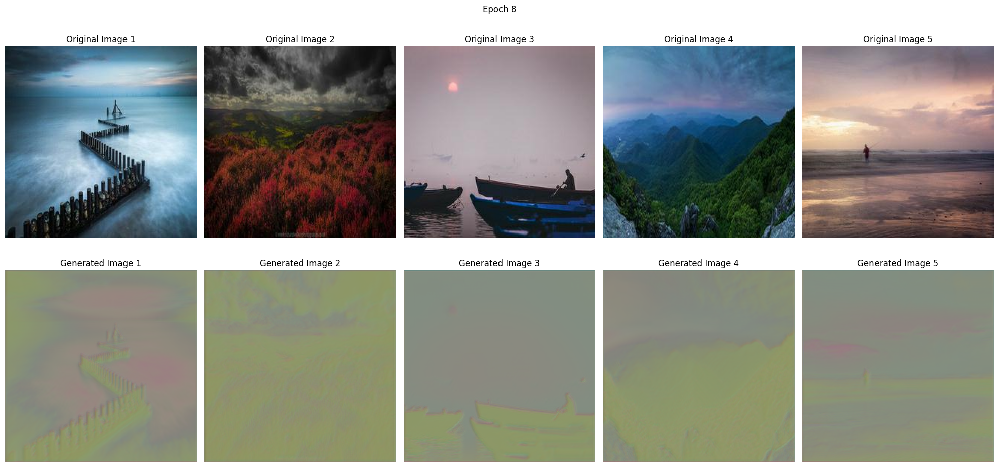
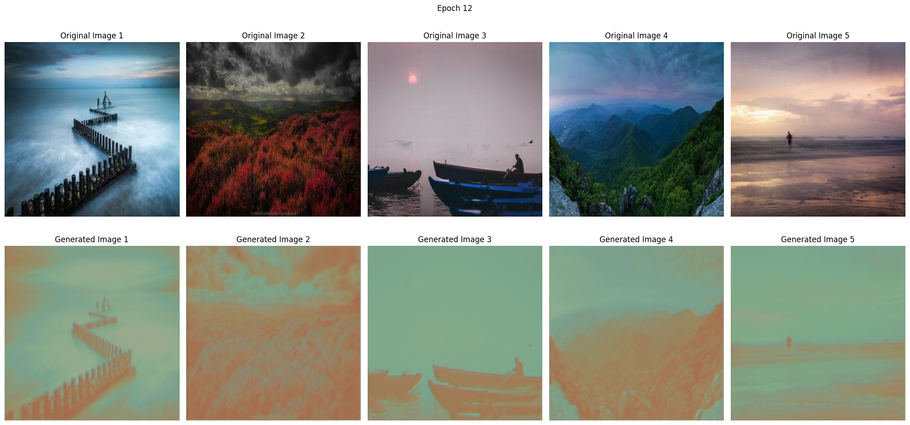
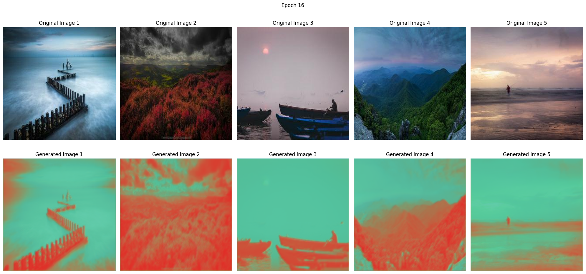
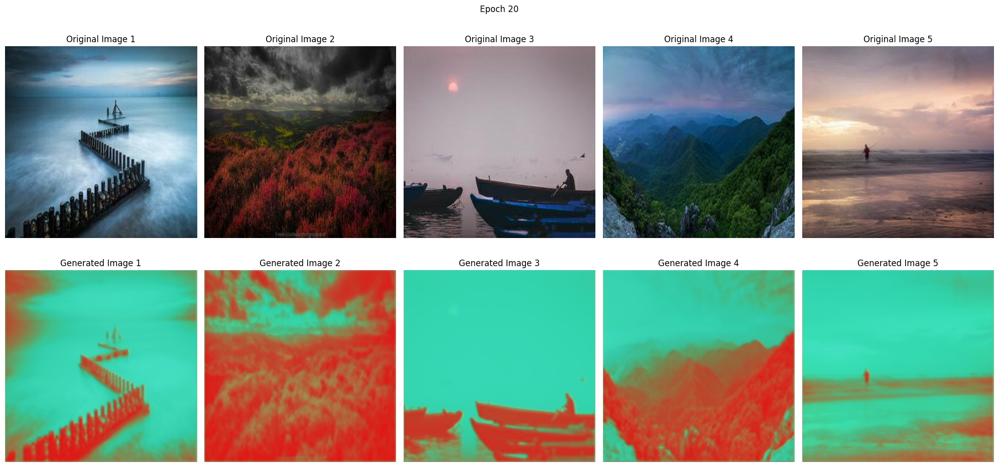
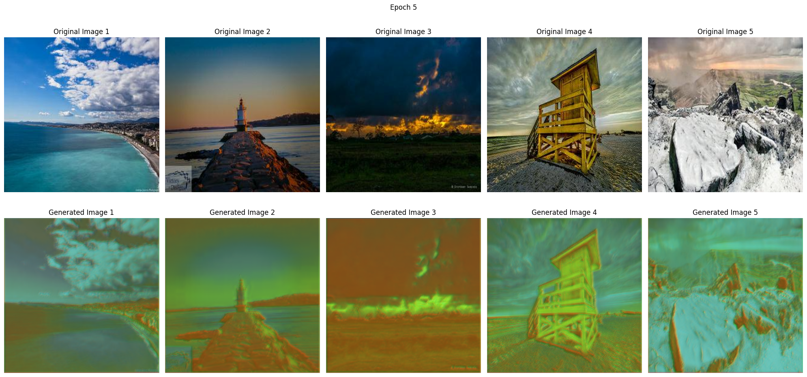
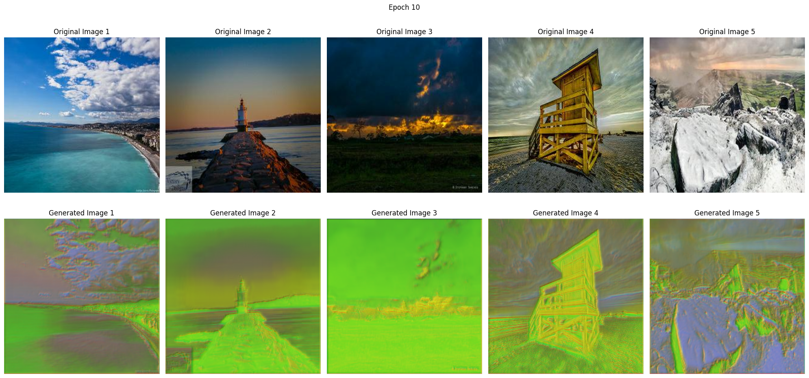

Model: "model"
Successfully loaded Monet images: 300
Successfully loaded photo images: 100
Generator training dataset size: 4
Discriminator training dataset size: 10
Discriminator validation dataset size: 3
__________________________________________________________________________________________________
 Layer (type)                Output Shape                 Param #   Connected to                  
==================================================================================================
 input_1 (InputLayer)        [(None, 256, 256, 3)]        0         []                            
                                                                                                  
 conv2d (Conv2D)             (None, 128, 128, 64)         3136      ['input_1[0][0]']             
                                                                                                  
 leaky_re_lu (LeakyReLU)     (None, 128, 128, 64)         0         ['conv2d[0][0]']              
                                                                                                  
 conv2d_1 (Conv2D)           (None, 64, 64, 128)          131200    ['leaky_re_lu[0][0]']         
                                                                                                  
 batch_normalization (Batch  (None, 64, 64, 128)          512       ['conv2d_1[0][0]']            
 Normalization)                                                                                   
                                                                                                  
 leaky_re_lu_1 (LeakyReLU)   (None, 64, 64, 128)          0         ['batch_normalization[0][0]'] 
                                                                                                  
 conv2d_2 (Conv2D)           (None, 32, 32, 256)          524544    ['leaky_re_lu_1[0][0]']       
                                                                                                  
 batch_normalization_1 (Bat  (None, 32, 32, 256)          1024      ['conv2d_2[0][0]']            
 chNormalization)                                                                                 
                                                                                                  
 leaky_re_lu_2 (LeakyReLU)   (None, 32, 32, 256)          0         ['batch_normalization_1[0][0]'
                                                                    ]                             
                                                                                                  
 conv2d_3 (Conv2D)           (None, 16, 16, 512)          2097664   ['leaky_re_lu_2[0][0]']       
                                                                                                  
 batch_normalization_2 (Bat  (None, 16, 16, 512)          2048      ['conv2d_3[0][0]']            
 chNormalization)                                                                                 
                                                                                                  
 leaky_re_lu_3 (LeakyReLU)   (None, 16, 16, 512)          0         ['batch_normalization_2[0][0]'
                                                                    ]                             
                                                                                                  
 conv2d_transpose (Conv2DTr  (None, 32, 32, 256)          2097408   ['leaky_re_lu_3[0][0]']       
 anspose)                                                                                         
                                                                                                  
 batch_normalization_3 (Bat  (None, 32, 32, 256)          1024      ['conv2d_transpose[0][0]']    
 chNormalization)                                                                                 
                                                                                                  
 re_lu (ReLU)                (None, 32, 32, 256)          0         ['batch_normalization_3[0][0]'
                                                                    ]                             
                                                                                                  
 concatenate (Concatenate)   (None, 32, 32, 512)          0         ['re_lu[0][0]',               
                                                                     'leaky_re_lu_2[0][0]']       
                                                                                                  
 conv2d_transpose_1 (Conv2D  (None, 64, 64, 128)          1048704   ['concatenate[0][0]']         
 Transpose)                                                                                       
                                                                                                  
 batch_normalization_4 (Bat  (None, 64, 64, 128)          512       ['conv2d_transpose_1[0][0]']  
 chNormalization)                                                                                 
                                                                                                  
 re_lu_1 (ReLU)              (None, 64, 64, 128)          0         ['batch_normalization_4[0][0]'
                                                                    ]                             
                                                                                                  
 concatenate_1 (Concatenate  (None, 64, 64, 256)          0         ['re_lu_1[0][0]',             
 )                                                                   'leaky_re_lu_1[0][0]']       
                                                                                                  
 conv2d_transpose_2 (Conv2D  (None, 128, 128, 64)         262208    ['concatenate_1[0][0]']       
 Transpose)                                                                                       
                                                                                                  
 batch_normalization_5 (Bat  (None, 128, 128, 64)         256       ['conv2d_transpose_2[0][0]']  
 chNormalization)                                                                                 
                                                                                                  
 re_lu_2 (ReLU)              (None, 128, 128, 64)         0         ['batch_normalization_5[0][0]'
                                                                    ]                             
                                                                                                  
 concatenate_2 (Concatenate  (None, 128, 128, 128)        0         ['re_lu_2[0][0]',             
 )                                                                   'leaky_re_lu[0][0]']         
                                                                                                  
 conv2d_transpose_3 (Conv2D  (None, 256, 256, 3)          6147      ['concatenate_2[0][0]']       
 Transpose)                                                                                       
                                                                                                  
==================================================================================================
Total params: 6176387 (23.56 MB)
Trainable params: 6173699 (23.55 MB)
Non-trainable params: 2688 (10.50 KB)
__________________________________________________________________________________________________
Discriminator loaded successfully.
Batch 1/4: Generator Loss: 0.5606218576431274, Discriminator Loss: 6.388216972351074
Batch 2/4: Generator Loss: 1.0579626560211182, Discriminator Loss: 4.99527645111084
Batch 3/4: Generator Loss: 1.049159288406372, Discriminator Loss: 3.7098164558410645
Batch 4/4: Generator Loss: 0.5317555069923401, Discriminator Loss: 1.8708012104034424
Epoch: 1, Overall Generator Loss: 0.7998747825622559, Overall Discriminator Loss: 4.24102783203125

Batch 1/4: Generator Loss: 1.6571829319000244, Discriminator Loss: 1.939281940460205
Batch 2/4: Generator Loss: 1.7904746532440186, Discriminator Loss: 1.6107983589172363
Batch 3/4: Generator Loss: 1.5417251586914062, Discriminator Loss: 1.8516978025436401
Batch 4/4: Generator Loss: 1.5462311506271362, Discriminator Loss: 2.0287322998046875
Epoch: 2, Overall Generator Loss: 1.6339035034179688, Overall Discriminator Loss: 1.8576276302337646

Batch 1/4: Generator Loss: 1.474496841430664, Discriminator Loss: 1.0415301322937012
Batch 2/4: Generator Loss: 1.4642963409423828, Discriminator Loss: 1.1227335929870605
Batch 3/4: Generator Loss: 1.4065814018249512, Discriminator Loss: 0.8603243231773376
Batch 4/4: Generator Loss: 0.9072635173797607, Discriminator Loss: 1.581085205078125
Epoch: 3, Overall Generator Loss: 1.313159465789795, Overall Discriminator Loss: 1.1514183282852173

Batch 1/4: Generator Loss: 1.4377251863479614, Discriminator Loss: 0.656658411026001
Batch 2/4: Generator Loss: 1.4718741178512573, Discriminator Loss: 0.7344493865966797
Batch 3/4: Generator Loss: 1.754971981048584, Discriminator Loss: 0.586060106754303
Batch 4/4: Generator Loss: 1.5684266090393066, Discriminator Loss: 0.9800258874893188
Epoch: 4, Overall Generator Loss: 1.5582494735717773, Overall Discriminator Loss: 0.7392984628677368

Batch 1/4: Generator Loss: 1.1330987215042114, Discriminator Loss: 0.6928874850273132
Batch 2/4: Generator Loss: 1.41721773147583, Discriminator Loss: 0.5163226127624512
Batch 3/4: Generator Loss: 1.6475714445114136, Discriminator Loss: 0.5137423276901245
Batch 4/4: Generator Loss: 1.8761255741119385, Discriminator Loss: 0.9964814186096191
Epoch: 5, Overall Generator Loss: 1.5185034275054932, Overall Discriminator Loss: 0.6798584461212158

......
Batch 1/4: Generator Loss: 2.3059189319610596, Discriminator Loss: 0.2571815550327301
Batch 2/4: Generator Loss: 2.570662498474121, Discriminator Loss: 0.2549237012863159
Batch 3/4: Generator Loss: 2.744856357574463, Discriminator Loss: 0.23237089812755585
Batch 4/4: Generator Loss: 1.0118238925933838, Discriminator Loss: 1.1551573276519775
Epoch: 8, Overall Generator Loss: 2.158315420150757, Overall Discriminator Loss: 0.47490835189819336

Batch 1/4: Generator Loss: 0.9076876640319824, Discriminator Loss: 0.8070051074028015
Batch 2/4: Generator Loss: 2.790339946746826, Discriminator Loss: 0.14640682935714722
Batch 3/4: Generator Loss: 2.3304073810577393, Discriminator Loss: 0.4040912985801697
Batch 4/4: Generator Loss: 2.5967650413513184, Discriminator Loss: 0.3179137706756592
Epoch: 12, Overall Generator Loss: 2.1563000679016113, Overall Discriminator Loss: 0.4188542366027832

Batch 1/4: Generator Loss: 3.943450689315796, Discriminator Loss: 0.05570491403341293
Batch 2/4: Generator Loss: 3.9530816078186035, Discriminator Loss: 0.05548575520515442
Batch 3/4: Generator Loss: 3.332035779953003, Discriminator Loss: 0.07495690137147903
Batch 4/4: Generator Loss: 3.548668384552002, Discriminator Loss: 0.06882668286561966
Epoch: 16, Overall Generator Loss: 3.6943092346191406, Overall Discriminator Loss: 0.06374356150627136

Batch 1/4: Generator Loss: 4.853442192077637, Discriminator Loss: 0.025181692093610764
Batch 2/4: Generator Loss: 4.892550945281982, Discriminator Loss: 0.018770240247249603
Batch 3/4: Generator Loss: 4.883467674255371, Discriminator Loss: 0.02163570560514927
Batch 4/4: Generator Loss: 5.335407257080078, Discriminator Loss: 0.08411062508821487
Epoch: 20, Overall Generator Loss: 4.991216659545898, Overall Discriminator Loss: 0.037424564361572266

Batch 1/7: Generator Loss: 2.8187901973724365, Discriminator Loss: 0.290010929107666
Batch 2/7: Generator Loss: 2.5894393920898438, Discriminator Loss: 0.280670166015625
Batch 3/7: Generator Loss: 2.9349451065063477, Discriminator Loss: 0.2289668172597885
Batch 4/7: Generator Loss: 0.5167129039764404, Discriminator Loss: 1.4870553016662598
Batch 5/7: Generator Loss: 4.174924850463867, Discriminator Loss: 0.7197968363761902
Batch 6/7: Generator Loss: 2.204157590866089, Discriminator Loss: 0.6062412261962891
Batch 7/7: Generator Loss: 2.1739485263824463, Discriminator Loss: 0.4786556363105774
Epoch: 5, Overall Generator Loss: 2.4875600337982178, Overall Discriminator Loss: 0.5844852328300476

Batch 1/7: Generator Loss: 4.733861923217773, Discriminator Loss: 0.047803640365600586
Batch 2/7: Generator Loss: 5.068470001220703, Discriminator Loss: 0.07721959054470062
Batch 3/7: Generator Loss: 4.839747428894043, Discriminator Loss: 0.04348469525575638
Batch 4/7: Generator Loss: 5.0311784744262695, Discriminator Loss: 0.04014454409480095
Batch 5/7: Generator Loss: 5.2178239822387695, Discriminator Loss: 0.052366189658641815
Batch 6/7: Generator Loss: 5.166036605834961, Discriminator Loss: 0.039157286286354065
Batch 7/7: Generator Loss: 5.4220871925354, Discriminator Loss: 0.03751809895038605
Epoch: 10, Overall Generator Loss: 5.068458080291748, Overall Discriminator Loss: 0.048242006450891495
